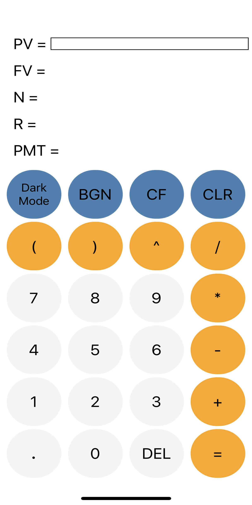
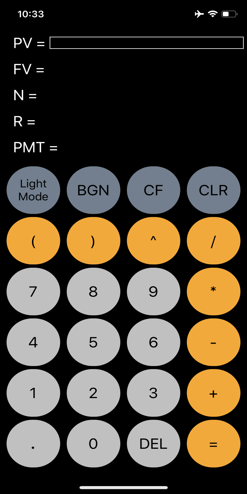

# financial-calculator
A react native app for performing Time Value of Money (TVM) calculations. It can be used to calculate anything from simple/compound interest to mortgage and annuity payments.
# Motivation
The app was inspired from FIN 221 - Corporate Finance course that I took in Spring 2019 wherein we extensively used a financial calculator. 
However, the interface of the Texas Instruments BA II Financial calculator was not very intuitive and it included many additional features that were not required for the course. 
So this is my attempt at building a Financial calculator with an intuitive UI that anyone can run on their IOS/Android devices.
# Additional Features
* Dark Mode
* Cash flow table for calculating Net Present Value (NPV) and Internal Rate of Return (IRR)
# Screenshots
## Light Mode

## Dark Mode

## Cash Flow Table

